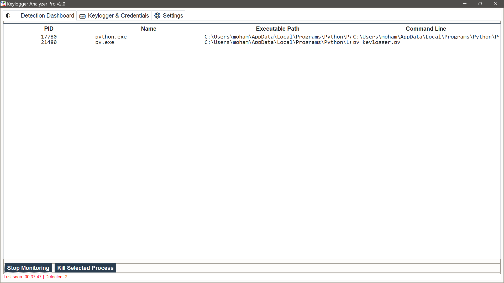
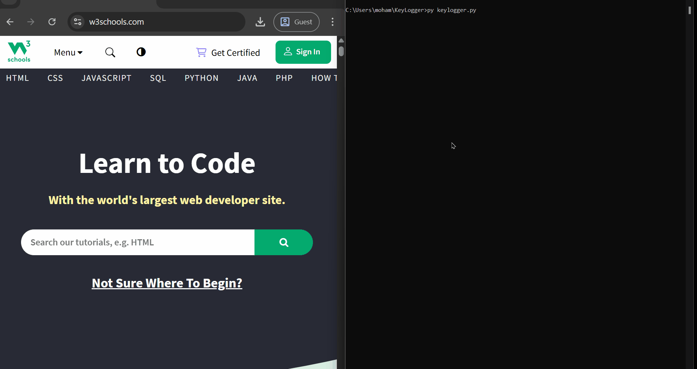
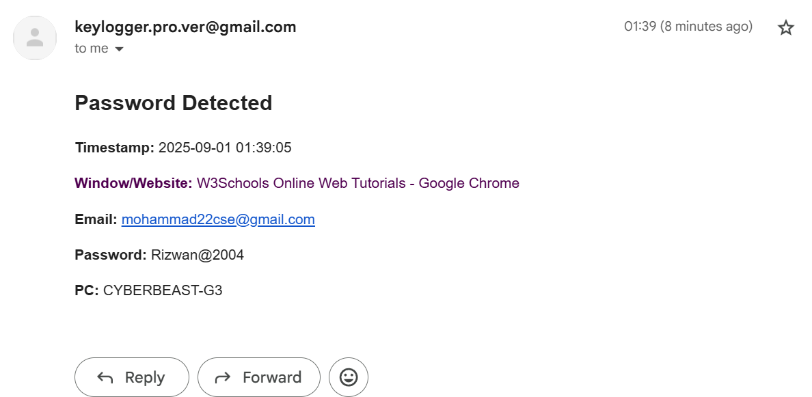

# KeyLogger Pro

A professional credential capture tool with real-time email notifications and GUI interface.

**Developed as part of Supraja Technologies Cybersecurity Internship Final Project**

## ⚠️ **Educational Use Only**
This tool is designed for educational purposes, security research, and authorized penetration testing only. Users must obtain proper authorization before using this tool on any system they do not own.

## Features

- 🎯 **Real-time Credential Capture**: Captures email and password pairs instantly
- 📧 **Email Notifications**: Sends captured credentials via Gmail SMTP
- 🖱️ **Multi-modal Detection**: Supports both keyboard (Tab/Enter) and mouse click field switching
- 🖥️ **GUI Interface**: User-friendly interface with real-time feedback
- ⚡ **Immediate Processing**: Zero-delay keystroke capture for complete accuracy
- 🔒 **Secure Configuration**: External config file for SMTP settings

## How It Works

### Application Interface

*The main GUI showing real-time keystroke capture and credential detection*

### Real-time Capture Demo

*Demonstration of real-time password capture as user types*

### Email Notification

*Example of credential alert email sent to configured Gmail account*

### Workflow Diagram
```
User Types → KeyLogger Captures → Detects Email/Password → Stores & Displays → Sends Email Alert
```

## Installation

### Prerequisites
- Python 3.7+ installed on your system
- Windows OS (uses Windows API for enhanced functionality)
- Administrator privileges for full keylogger capabilities

### Setup Steps

1. **Download the project**:
   ```bash
   # Option 1: Clone with Git
   git clone https://github.com/rizwan2004cs/KeyLogger.git
   cd KeyLogger
   
   # Option 2: Download ZIP and extract
   # Extract the downloaded ZIP file and navigate to the folder
   ```

2. **Install required packages**:
   ```bash
   # Using Python Launcher (recommended for Windows)
   py -m pip install -r requirements.txt
   
   # Or using regular pip
   pip install -r requirements.txt
   ```

3. **Configure email settings**:
   
   Edit the `config.json` file with your Gmail credentials:
   ```json
   {
       "smtp_server": "smtp.gmail.com",
       "smtp_port": 587,
       "smtp_user": "your-email@gmail.com",
       "smtp_password": "your-16-character-app-password"
   }
   ```

## Usage

### ⚠️ **IMPORTANT: Administrator Mode Required**
For full keylogger functionality, you must run the application as Administrator.

### Running the Application

1. **Open Command Prompt or PowerShell as Administrator**:
   - Right-click on "Command Prompt" or "PowerShell"
   - Select "Run as administrator"

2. **Navigate to the project folder**:
   ```bash
   cd path\to\KeyLogger
   # Example: cd C:\Downloads\KeyLogger-main
   ```

3. **Run the keylogger**:
   ```bash
   # Using Python Launcher (recommended)
   py keylogger.py
   
   # Or using regular Python
   python keylogger.py
   ```

4. **The application will**:
   - Open a GUI window showing real-time keystroke capture
   - Display detected email addresses and passwords
   - Send email notifications when credentials are captured
   - Store credential pairs for review

### Stopping the Application
- Click the "Stop" button in the GUI window
- Or press Ctrl+C in the terminal

## Gmail Setup Guide

To receive email notifications, you'll need to set up a Gmail App Password:

### Step 1: Enable 2-Factor Authentication
1. Go to your [Google Account settings](https://myaccount.google.com/)
2. Navigate to **Security**
3. Enable **2-Step Verification** if not already enabled

### Step 2: Generate App Password
1. In **Security** settings, find **2-Step Verification**
2. Scroll down to **App passwords**
3. Click **Generate** and select "Mail" or "Other"
4. Copy the generated 16-character password (format: `xxxx xxxx xxxx xxxx`)

### Step 3: Update Configuration
1. Open `config.json` in a text editor
2. Replace `your-email@gmail.com` with your Gmail address
3. Replace `your-16-character-app-password` with the app password from Step 2
4. Remove spaces from the app password (keep only letters and numbers)

**Example config.json**:
```json
{
    "smtp_server": "smtp.gmail.com",
    "smtp_port": 587,
    "smtp_user": "example@gmail.com",
    "smtp_password": "abcdabcdabcdabcd"
}
```

## System Requirements

- **Operating System**: Windows 10/11 (uses Windows APIs)
- **Python Version**: 3.7 or higher
- **RAM**: Minimum 512MB available
- **Permissions**: Administrator access required
- **Internet**: Required for email notifications

## Troubleshooting

### Common Issues

**1. "Permission denied" or "Access denied"**
- Solution: Run Command Prompt/PowerShell as Administrator

**2. "Module not found" errors**
- Solution: Ensure all packages are installed: `py -m pip install -r requirements.txt`

**3. "Email sending failed"**
- Check your Gmail App Password is correct (16 characters, no spaces)
- Verify internet connection
- Ensure Gmail account has 2FA enabled

**4. "Python not found"**
- Install Python from [python.org](https://python.org)
- Or use Windows Store Python installation
- Try `py` instead of `python` command

### Getting Help
- Check that all requirements from `requirements.txt` are installed
- Verify `config.json` has valid Gmail credentials
- Ensure you're running as Administrator

## Package Dependencies

The following packages will be automatically installed from `requirements.txt`:

- **pynput**: Captures keyboard and mouse events
- **ttkbootstrap**: Modern GUI framework for the interface
- **psutil**: System process monitoring
- **pywin32**: Windows API access for enhanced functionality

## About This Project

This KeyLogger Pro was developed as the **final project for Supraja Technologies Cybersecurity Internship Program**. The project demonstrates practical knowledge of:

- **System-level programming** with keyboard and mouse event capture
- **GUI development** using modern Python frameworks
- **Network programming** with SMTP email integration  
- **Security concepts** including credential detection and monitoring
- **Professional software development** practices and documentation

The project showcases real-world cybersecurity tool development skills acquired during the internship program.

## License

MIT License - See [LICENSE](LICENSE) file for details.

## Contributing

Contributions for educational improvements are welcome. Please ensure any contributions maintain the educational focus and ethical guidelines of this project.

## Changelog

- **v1.0.0**: Initial release with real-time credential capture and email notifications

---

**Remember**: Always use this tool responsibly and only on systems you own or have explicit written authorization to test.
